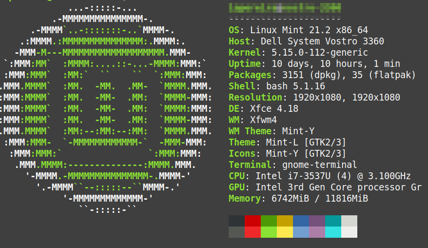
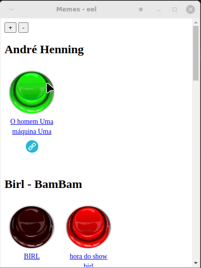

# memes_eel

Criando aplicativos Python Desktop com o framework EEL, que permite criar aplicações desktop com HTML,CSS e JS.

Esta aplicação exibe alguns dos principais memes da internet brasileira.

O software foi desenvolvido na seguinte máquina:



## Demo



## Requirements

```
pip install eel
pip install PyInstaller
```

## Generate app

```
python -m eel main.py web --onefile --noconsole
```

## Run

```
cd dist
./main
```
